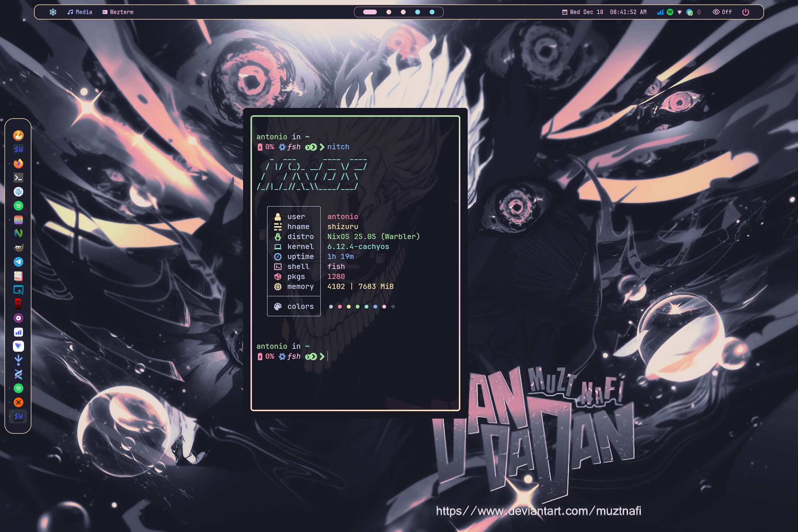
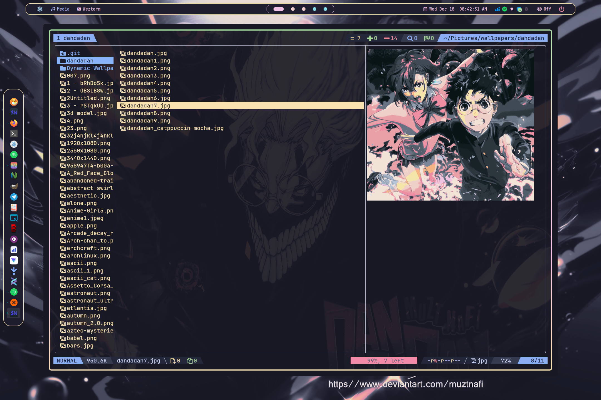
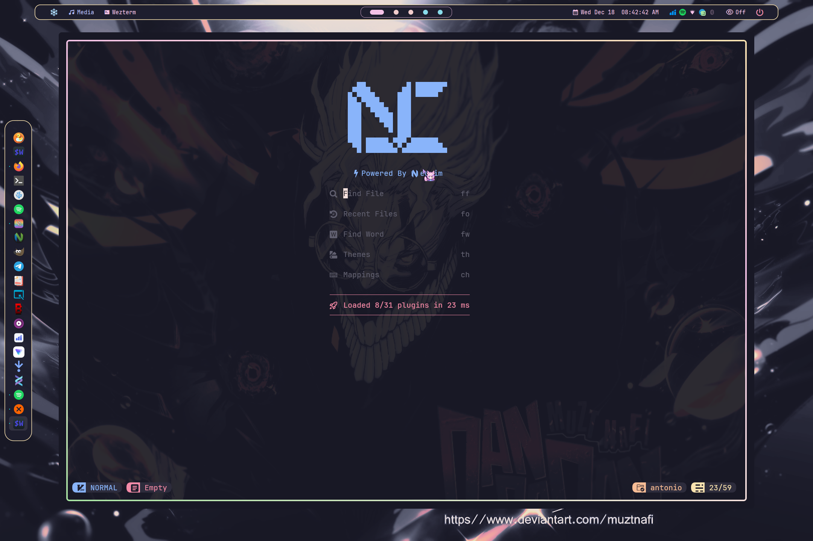
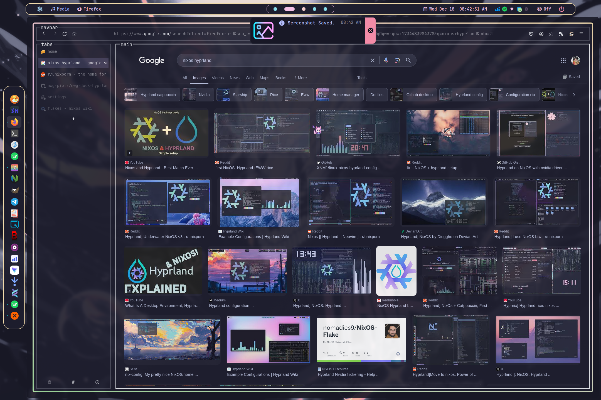
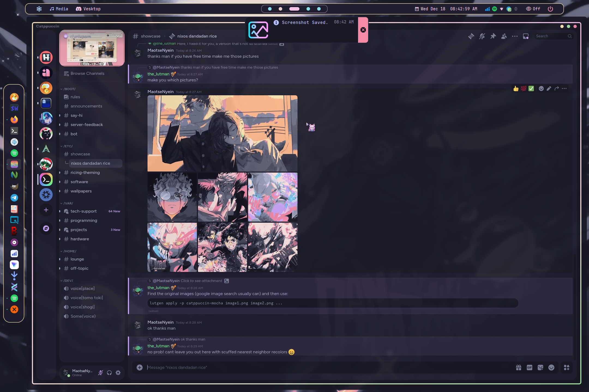

 Ags Overview support. Major Change. Now i currently move to nixos and this config is for my nixos system. Plugin support.

### 🖼️ Gallery

     
     
     
     
      
     
   Screenshots last updated <b>2024-12-21</b>

